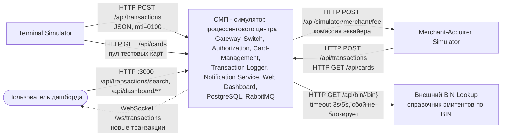

# А1. C4 Level 1 - Context

## Чего не хватало и что сделано

- В проекте Context-диаграммы не было: в `docs/architecture.md` есть только общая схема контейнеров, граница «СМП / внешний мир» не проведена.
- Сделано: СМП показана одним блоком, снаружи - четыре актора и протокол входа каждого. Направление стрелки - кто инициирует вызов.
- Сплошная стрелка - синхронный вызов (HTTP), пунктир - WebSocket-поток от системы к пользователю.

## Диаграмма

## Подтверждение кодом

| Связь | Где в коде |
|---|---|
| Терминал → СМП: `POST /api/transactions` | [`GatewayClient.java`](../../../services/terminal-simulator/src/main/java/com/processing/terminalsimulator/client/GatewayClient.java) - `rest.post().uri(gatewayUrl + "/api/transactions")` |
| Терминал → СМП: `GET /api/cards` | тот же `GatewayClient` - `cardManagementUrl + "/api/cards"`; в [`docker-compose.yaml`](../../../docker-compose.yaml) `CARD_MGMT_URL=http://card-management:8080` |
| Мерчант → СМП | [`GatewayClient.java`](../../../services/merchant-acquirer/src/main/java/com/processing/merchantacquirer/client/GatewayClient.java) - `/api/cards`, `/api/transactions` |
| СМП → мерчант: комиссия | [`MerchantAcquirerClient.java`](../../../services/switch/src/main/java/com/processing/service/MerchantAcquirerClient.java) - `POST /api/simulator/merchant/fee` |
| СМП → BIN Lookup | [`BinLookupClient.java`](../../../services/authorization/src/main/java/com/processing/authorization/client/BinLookupClient.java) - `GET /api/bin/{bin}`, connect 3000 ms, read 5000 ms, при ошибке `Optional.empty()` |
| Пользователь → дашборд | [`nginx.conf`](../../../services/dashboard/nginx.conf) - `/api/` проксируется в Gateway, `/ws/` - напрямую в Transaction Logger |
| WebSocket | [`useWebSocket.ts`](../../../services/dashboard/src/hooks/useWebSocket.ts), [`WebSocketConfig.java`](../../../services/transaction-logger/src/main/java/com/processing/transactionlogger/websocket/WebSocketConfig.java) - `/ws/transactions` |
| Единая точка входа | [`application.yml`](../../../services/gateway/src/main/resources/application.yml) Gateway - маршруты `/api/transactions`, `/api/cards/**`, `/api/dashboard/**`, `/api/simulator/**` |

## Для чего пригодится

Граница показывает, что в E2E-тестах эмулируется (терминал, мерчант), а что можно заглушить: BIN Lookup не влияет на решение, его сбой авторизацию не останавливает.
