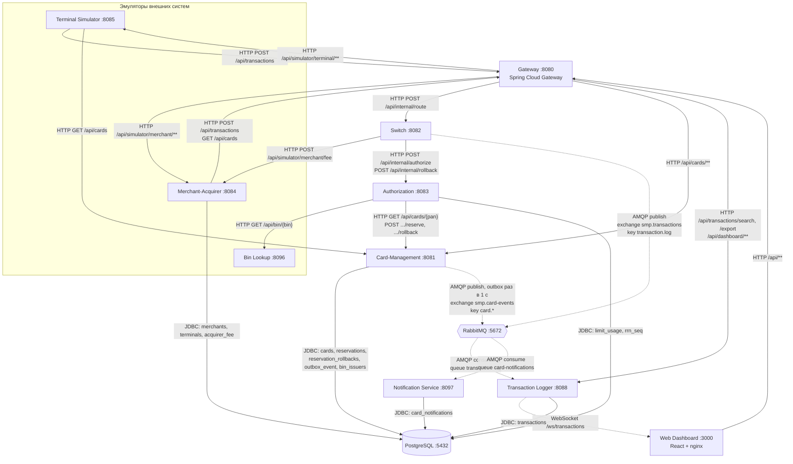

# А2. C4 Level 2 - Container

## Чего не хватало и что сделано

- В проекте есть `docs/architecture-diagram.puml` и mermaid-схема в `docs/architecture.md`, но все стрелки в них одинаковые: sync и async не различаются, exchange и очереди не названы.
- Нет связей, которые есть в коде: Switch → Merchant-Acquirer (комиссия), Terminal Simulator → Card-Management напрямую, Dashboard → Logger по WebSocket, Merchant-Acquirer → PostgreSQL.
- Сделано: схема собрана по `docker-compose.yaml` и клиентам в коде. Сплошная стрелка - sync (HTTP или JDBC), пунктир - async (AMQP), у async подписаны exchange, routing key и очередь.

## Диаграмма

## Сверка с `docker-compose.yaml`

| Контейнер compose | Порт хоста | Зависимости (`environment`, `depends_on`) |
|---|---|---|
| `gateway` | 8080 | `SWITCH_URL`, `AUTH_URL`, `CARD_MGMT_URL`, `LOGGER_URL`, `TERMINAL_SIM_URL`, `MERCHANT_SIM_URL` |
| `card-management` | 8081 | postgres, rabbitmq |
| `switch` | 8082 | `AUTH_URL`, `LOGGER_URL`, `MERCHANT_URL`, rabbitmq |
| `authorization` | 8083 | postgres, `CARD_MGMT_URL`, `BIN_LOOKUP_URL` |
| `merchant-acquirer` | 8084 | `GATEWAY_URL`, postgres |
| `terminal-simulator` | 8085 | `GATEWAY_URL`, `CARD_MGMT_URL` |
| `transaction-logger` | 8088 | postgres, rabbitmq |
| `bin-lookup` | 8096 | - |
| `notification-service` | 8097 | rabbitmq, postgres |
| `dashboard` | 3000 | `GATEWAY_URL`, `LOGGER_URL`, `LOGGER_WS_URL` |
| `postgres` | 5432 | - |
| `rabbitmq` | 5672, 15672 | - |

## Подтверждение кодом

| Связь | Тип | Где в коде |
|---|---|---|
| Gateway → сервисы | sync HTTP | [`gateway/application.yml`](../../../services/gateway/src/main/resources/application.yml) - `spring.cloud.gateway.routes`, `RewritePath=/api/transactions, /api/internal/route` |
| Switch → Authorization | sync HTTP | [`AuthorizationClient.java`](../../../services/switch/src/main/java/com/processing/service/AuthorizationClient.java) - `callAuthorize`, `rollback` |
| Switch → Merchant-Acquirer | sync HTTP | [`MerchantAcquirerClient.java`](../../../services/switch/src/main/java/com/processing/service/MerchantAcquirerClient.java) - `fetchAcquiringFee`: `POST /api/simulator/merchant/fee` |
| Authorization → Card-Management | sync HTTP | [`CardManagementClientImpl.java`](../../../services/authorization/src/main/java/com/processing/authorization/client/CardManagementClientImpl.java) - `getCard`, `reserve`, `rollback` |
| Authorization → Bin Lookup | sync HTTP | [`BinLookupClient.java`](../../../services/authorization/src/main/java/com/processing/authorization/client/BinLookupClient.java) - `getIssuerId`: `GET /api/bin/{bin}` |
| Authorization → PostgreSQL | sync JDBC | [`LimitUsageRepository.java`](../../../services/authorization/src/main/java/com/processing/authorization/repositories/LimitUsageRepository.java) - `upsertLimitUsage`, `fetchRrnBlock` |
| Card-Management → PostgreSQL | sync JDBC | [`CardJpaRepository.java`](../../../services/card-management/src/main/java/com/processing/cardmanagement/repositories/CardJpaRepository.java) - `findByPan`, `findWithPessimisticLockByPan`; таблицы созданы миграциями `V5.1`-`V5.8` |
| Transaction Logger → PostgreSQL | sync JDBC | [`TransactionRepository.java`](../../../services/transaction-logger/src/main/java/com/processing/transactionlogger/repository/TransactionRepository.java) - `saveAndFlush` в `TransactionService.store`; таблица из миграции `V1__create_transactions_table.sql` |
| Notification Service → PostgreSQL | sync JDBC | [`CardNotificationRepository.java`](../../../services/notification-service/src/main/java/com/processing/notification/repository/CardNotificationRepository.java) - `repository.save` в `CardEventListener.handleCardEvent` |
| Merchant-Acquirer → PostgreSQL | sync JDBC | [`MerchantRepository.java`](../../../services/merchant-acquirer/src/main/java/com/processing/merchantacquirer/repository/MerchantRepository.java), `TerminalRepository`, `AcquirerFeeRepository`; таблицы из миграций `V71`-`V74` |
| Switch → RabbitMQ | async AMQP | [`LoggerClient.java`](../../../services/switch/src/main/java/com/processing/service/LoggerClient.java) - `rabbitTemplate.convertAndSend(EXCHANGE, ROUTING_KEY, transaction)` |
| RabbitMQ → Logger | async AMQP | [`TransactionLogListener.java`](../../../services/transaction-logger/src/main/java/com/processing/transactionlogger/listener/TransactionLogListener.java) - `@RabbitListener(queues = "transaction-log")` |
| Card-Management → RabbitMQ | async AMQP | [`OutboxProcessor.java`](../../../services/card-management/src/main/java/com/processing/cardmanagement/services/OutboxProcessor.java), [`OutboxEventProcessorImpl.java`](../../../services/card-management/src/main/java/com/processing/cardmanagement/services/OutboxEventProcessorImpl.java) - `process` по расписанию вызывает `processSingleEvent`: `convertAndSend(CARD_EVENTS_EXCHANGE, "card." + имя события, event)` |
| RabbitMQ → Notification | async AMQP | [`CardEventListener.java`](../../../services/notification-service/src/main/java/com/processing/notification/listener/CardEventListener.java) - `@RabbitListener(queues = "card-notifications")` |

Связей симуляторов и дашборда в этой таблице нет: Terminal Simulator → Gateway и Card-Management, Merchant-Acquirer → Gateway, Web Dashboard → Gateway и WebSocket подтверждены в таблице [А1](a1-c4-context.md).

## Что увидел в коде и чего нет в документации

- В задании и README - «11 сервисов», в `docker-compose.yaml` прикладных контейнеров **10** (плюс PostgreSQL и RabbitMQ). В `services/` кроме них лежат только библиотека `common` и модуль `e2e-tests`.
- У Switch задан `LOGGER_URL`, но HTTP-вызова Logger в коде Switch нет: транзакция уходит только через RabbitMQ. Эндпоинт `POST /api/internal/log` в Logger остался, но Switch его не вызывает.
- У Notification Service и Bin Lookup нет маршрута в Gateway: они доступны только по своим портам.
- Каждый резерв и откат в Card-Management тоже порождает событие в `smp.card-events`, не только создание и изменение карты.

## Для чего пригодится

Сплошные HTTP-стрелки - это контракты для API-тестов. Пунктирные AMQP-стрелки проверяются интеграционными тестами: сообщение ушло, потребитель получил, запись в БД появилась.
