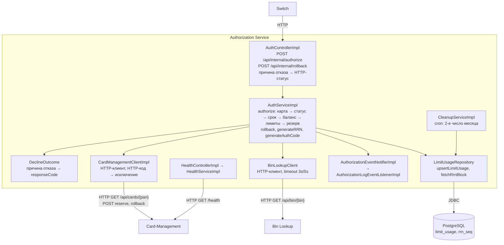
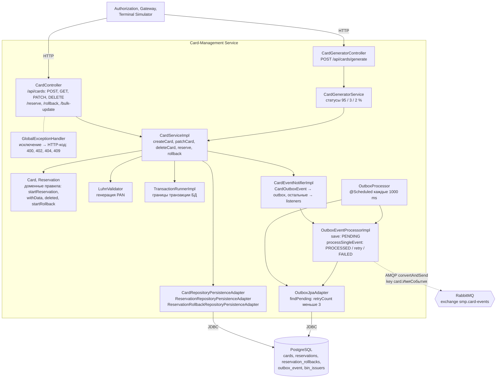

# А3. C4 Level 3 - Component (Authorization и Card-Management)

## Чего не хватало и что сделано

- Компонентного уровня в проекте не было совсем: в документации нет схемы, показывающей что внутри сервиса.
- Сделано: по пакетам `services/authorization` и `services/card-management` построены две схемы controller → service → client / repository. Отмечено, где HTTP-клиенты, где JDBC и где outbox-публикация.
- Сплошная стрелка - sync (вызов метода, HTTP, JDBC), пунктир - async (AMQP).

## Authorization

## Card-Management

## Подтверждение кодом

Каждая строка подтверждает стрелку диаграммы: в каком файле один компонент обращается к другому и каким вызовом.

### Authorization

| Стрелка на диаграмме | Файл | Строки кода, которые её подтверждают |
|---|---|---|
| Switch → `AuthControllerImpl`, HTTP | [`AuthControllerImpl.java`](../../../services/authorization/src/main/java/com/processing/authorization/controller/AuthControllerImpl.java) | `@RequestMapping("/api/internal")`, `@PostMapping("/authorize")`, `@PostMapping("/rollback")` |
| `AuthControllerImpl` → `AuthServiceImpl` | [`AuthControllerImpl.java`](../../../services/authorization/src/main/java/com/processing/authorization/controller/AuthControllerImpl.java) | `authService.authorize(request, requestInputTime)`, `authService.rollback(request, requestInputTime)` |
| `AuthServiceImpl` → клиенты, репозиторий, `DeclineOutcome`, события | [`AuthServiceImpl.java`](../../../services/authorization/src/main/java/com/processing/authorization/services/AuthServiceImpl.java) | `cardManagementClient.getCard`, `.reserve`, `.rollback`; `binLookupClient.getIssuerId`; `limitUsageRepository.upsertLimitUsage`, `.fetchRrnBlock`; `DeclineOutcome.CARD_BLOCKED.buildAuthorization`; `eventNotifier.notify` |
| `CardManagementClientImpl` → Card-Management, HTTP | [`CardManagementClientImpl.java`](../../../services/authorization/src/main/java/com/processing/authorization/client/CardManagementClientImpl.java) | `restClient.get()` на `/api/cards/{pan}`; `restClient.post()` на `/api/cards/{pan}/reserve` и `/api/cards/{pan}/rollback` |
| `BinLookupClient` → Bin Lookup, HTTP | [`BinLookupClient.java`](../../../services/authorization/src/main/java/com/processing/authorization/client/BinLookupClient.java) | `restClient.get().uri(binLookupUrl + "/api/bin/{bin}", bin)` |
| `LimitUsageRepository` → PostgreSQL, JDBC | [`LimitUsageRepository.java`](../../../services/authorization/src/main/java/com/processing/authorization/repositories/LimitUsageRepository.java) | `@Query(..., nativeQuery = true)`: `INSERT INTO limit_usage ... ON CONFLICT`, `nextval('rrn_seq')` |
| `CleanupServiceImpl` → `LimitUsageRepository` | [`CleanupServiceImpl.java`](../../../services/authorization/src/main/java/com/processing/authorization/services/CleanupServiceImpl.java) | `@Scheduled(cron = "0 0 0 2 * ?")`, `limitUsageRepository.deleteByUsageDateBetween` |
| `HealthControllerImpl` → `HealthServiceImpl` → Card-Management, HTTP | [`HealthServiceImpl.java`](../../../services/authorization/src/main/java/com/processing/authorization/services/HealthServiceImpl.java) | `healthService.healthCheckAllServices()` в контроллере; `restClient.get()` на `/health` в сервисе |

### Card-Management

| Стрелка на диаграмме | Файл | Строки кода, которые её подтверждают |
|---|---|---|
| Клиенты → `CardController`, `CardGeneratorController`, HTTP | [`CardController.java`](../../../services/card-management/src/main/java/com/processing/cardmanagement/controllers/CardController.java), [`CardGeneratorController.java`](../../../services/card-management/src/main/java/com/processing/cardmanagement/controllers/CardGeneratorController.java) | `@RequestMapping("/api/cards")`; `@PostMapping("/generate")` |
| `CardController` → `CardServiceImpl` | [`CardController.java`](../../../services/card-management/src/main/java/com/processing/cardmanagement/controllers/CardController.java) | `cardService.createCard`, `.getCard`, `.patchCard`, `.deleteCard`, `.reserve`, `.rollback` |
| `CardController` - `GlobalExceptionHandler` | [`GlobalExceptionHandler.java`](../../../services/card-management/src/main/java/com/processing/cardmanagement/configuration/GlobalExceptionHandler.java) | `@RestControllerAdvice`, методы `@ExceptionHandler` с `@ResponseStatus` |
| `CardGeneratorController` → `CardGeneratorService` → `CardServiceImpl` | [`CardGeneratorService.java`](../../../services/card-management/src/main/java/com/processing/cardmanagement/services/CardGeneratorService.java) | `generatorService.generate(request.count(), request.bins())` в контроллере; `cardService.createCards(cards)` в сервисе |
| `CardServiceImpl` → `Card`, `LuhnValidator`, `TransactionRunnerImpl`, репозитории, `CardEventNotifierImpl` | [`CardServiceImpl.java`](../../../services/card-management/src/main/java/com/processing/cardmanagement/services/CardServiceImpl.java) | `card.startReservation`, `card.withData`; `panGenerator.generatePan`; `transactionRunner.runSupplier`; `cardRepository.update`, `reservationRepository.save`; `eventNotifier.notifyListeners`. `LuhnValidator` подставлен как `PanGenerator` в `AppConfig` |
| `CardEventNotifierImpl` → `OutboxEventProcessorImpl` | [`CardEventNotifierImpl.java`](../../../services/card-management/src/main/java/com/processing/cardmanagement/events/CardEventNotifierImpl.java) | `outboxEventProcessor.save(new CardOutboxEventData(outboxEvent))` |
| `OutboxProcessor` → `OutboxJpaAdapter`, `OutboxEventProcessorImpl` | [`OutboxProcessor.java`](../../../services/card-management/src/main/java/com/processing/cardmanagement/services/OutboxProcessor.java) | `@Scheduled(fixedDelayString = "${app.outbox.interval-ms}")`; `outboxRepository.findPending`; `events.forEach(eventProcessor::processSingleEvent)` |
| `OutboxEventProcessorImpl` → RabbitMQ, AMQP; → `OutboxJpaAdapter` | [`OutboxEventProcessorImpl.java`](../../../services/card-management/src/main/java/com/processing/cardmanagement/services/OutboxEventProcessorImpl.java) | `rabbitTemplate.convertAndSend(CARD_EVENTS_EXCHANGE, ROUTING_KEY_PREFIX + имя класса события, event)`; `outboxRepository.save` |
| Репозитории → PostgreSQL, JDBC | [`CardJpaRepository.java`](../../../services/card-management/src/main/java/com/processing/cardmanagement/repositories/CardJpaRepository.java), [`OutboxJpaAdapter.java`](../../../services/card-management/src/main/java/com/processing/cardmanagement/repositories/OutboxJpaAdapter.java) | `extends JpaRepository`, `@Lock(LockModeType.PESSIMISTIC_WRITE)`; `findByStatusAndRetryCountLessThan` |

## Что увидел в коде и чего нет в документации

- В `AuthServiceImpl.authorize` **баланс проверяется раньше лимитов**, а в ТЗ порядок обратный: дневной лимит → месячный → баланс.
- Лимиты списываются в `limit_usage` **до** резерва в Card-Management. Если резерв потом не удался, метод возвращает отказ без исключения, и списание лимита не откатывается.
- `rollback` возвращает деньги на карту, но `limit_usage` не уменьшает, хотя ТЗ требует снять запись о расходе.
- Формат RRN в коде - `%1d%03d%08d`: последняя цифра года, день года и 8 цифр счётчика из `rrn_seq`. В ТЗ описан формат с часами, минутами и секундами.
- Bin Lookup вызывается после получения карты, его результат только пишется в лог и на решение не влияет.

## Для чего пригодится

По диаграмме видно, какие зависимости в unit-тестах заменяются моками:
- `AuthServiceImpl` тестируется с mock-объектами `CardManagementClient`, `BinLookupClient` и `LimitUsageRepository`;
- `Card` и `LuhnValidator` - чистая логика, моки не нужны;
- `LimitUsageRepository` с его SQL и outbox-цепочка проверяются уже интеграционно, с настоящими PostgreSQL и RabbitMQ.
