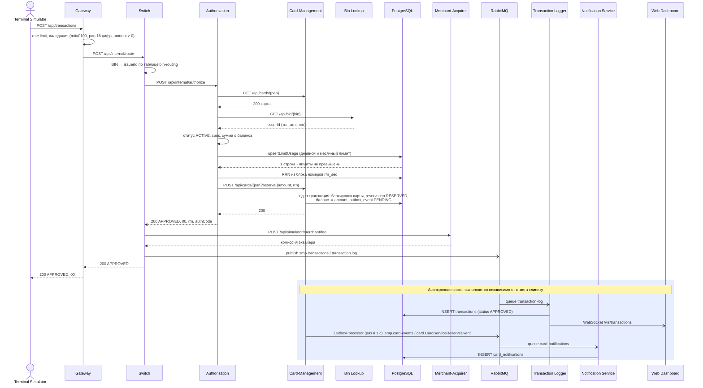
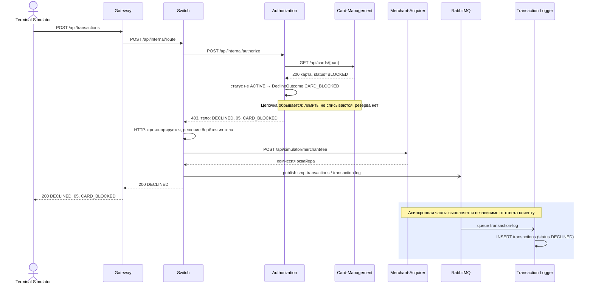
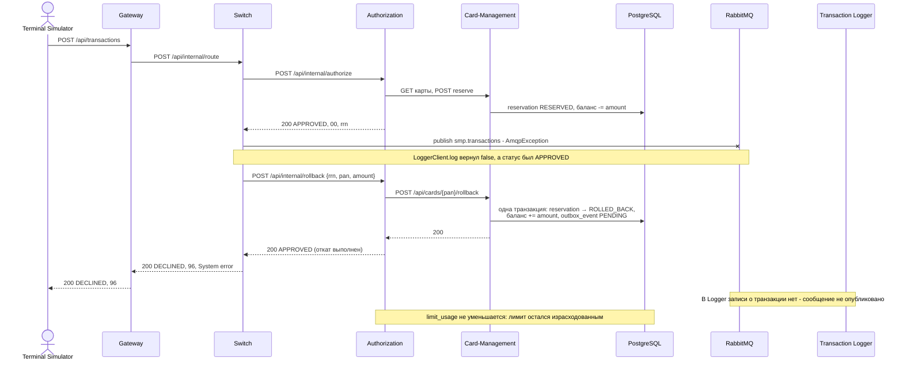

# А4. Sequence - путь транзакции

## Чего не хватало и что сделано

- В `docs/architecture.md` есть sequence только для happy path. Отказ там сведён к одной ветке `alt`, отката нет.
- Порядок шагов в той схеме не совпадает с кодом: Bin Lookup нарисован до запроса карты, нет вызова комиссии эквайера, не показаны проверки Gateway.
- Сделано: три сценария по коду - happy path, declined (карта `BLOCKED`) и reversal. Сплошная стрелка `->>` - синхронный вызов, `-)` - асинхронная публикация. Асинхронная часть обведена цветной рамкой: она выполняется независимо от ответа клиенту.

## 1. Happy path - транзакция одобрена

## 2. Declined - карта заблокирована

## 3. Reversal - публикация в RabbitMQ не удалась

## Подтверждение кодом

Каждая строка подтверждает шаг диаграммы: в каком файле и каким вызовом он выполняется.

### Шаги, общие для всех сценариев

| Шаг | Файл и строка кода |
|---|---|
| Terminal → Gateway → Switch | [`GatewayClient.java`](../../../services/terminal-simulator/src/main/java/com/processing/terminalsimulator/client/GatewayClient.java) - `sendToGateway`: `POST gatewayUrl + "/api/transactions"`; [`gateway/application.yml`](../../../services/gateway/src/main/resources/application.yml) - маршрут `switch` с `RewritePath=/api/transactions, /api/internal/route` |
| Gateway: rate limit, затем валидация | [`TransactionRateLimitFilter.java`](../../../services/gateway/src/main/java/com/processing/gateway/ratelimit/TransactionRateLimitFilter.java) - `getOrder` = `HIGHEST_PRECEDENCE + 1`; [`TransactionValidationFilter.java`](../../../services/gateway/src/main/java/com/processing/gateway/validation/TransactionValidationFilter.java) - `getOrder` = `HIGHEST_PRECEDENCE + 2`, `validator.validate(authorizationRequest)` |
| Switch: BIN → issuerId, вызов Authorization | [`RouteService.java`](../../../services/switch/src/main/java/com/processing/service/RouteService.java) - `routingService.getIssuerIdByPan(pan)`, `authorizationClient.authorize(routedRequest)`; [`RoutingService.java`](../../../services/switch/src/main/java/com/processing/service/RoutingService.java); [`AuthorizationClient.java`](../../../services/switch/src/main/java/com/processing/service/AuthorizationClient.java) - `callAuthorize`: `POST /api/internal/authorize` |
| Authorization → Card-Management: карта | [`AuthServiceImpl.java`](../../../services/authorization/src/main/java/com/processing/authorization/services/AuthServiceImpl.java) - `cardManagementClient.getCard(request.pan())` |
| Switch → Merchant-Acquirer: комиссия | [`RouteService.java`](../../../services/switch/src/main/java/com/processing/service/RouteService.java) - `acquiringFeeClient.fetchAcquiringFee(...)` сразу после `authorize`, при любом статусе; [`MerchantAcquirerClient.java`](../../../services/switch/src/main/java/com/processing/service/MerchantAcquirerClient.java) - `POST /api/simulator/merchant/fee` |
| Switch -) RabbitMQ: публикация | [`RouteService.java`](../../../services/switch/src/main/java/com/processing/service/RouteService.java) - `tryLog(transaction)`; [`LoggerClient.java`](../../../services/switch/src/main/java/com/processing/service/LoggerClient.java) - `rabbitTemplate.convertAndSend(EXCHANGE, ROUTING_KEY, transaction)` |
| RabbitMQ -) Logger: запись и WebSocket | [`TransactionLogListener.java`](../../../services/transaction-logger/src/main/java/com/processing/transactionlogger/listener/TransactionLogListener.java) - `handleTransaction` → `transactionService.store(request)`; [`TransactionService.java`](../../../services/transaction-logger/src/main/java/com/processing/transactionlogger/service/TransactionService.java) - `saveAndFlush`, `webSocketManager.broadcast` |

### Happy path

| Шаг | Файл и строка кода |
|---|---|
| Authorization → Bin Lookup, результат только в лог | [`AuthServiceImpl.java`](../../../services/authorization/src/main/java/com/processing/authorization/services/AuthServiceImpl.java) - `binLookupClient.getIssuerId(request.pan()).ifPresentOrElse(issuerId -> log.info(...), ...)`: значение дальше не используется |
| Проверки: статус, срок, баланс | [`AuthServiceImpl.java`](../../../services/authorization/src/main/java/com/processing/authorization/services/AuthServiceImpl.java) - `!currCardStatus.equals(CardModelStatus.ACTIVE)`, `lastValidDay.isBefore(transmissionDate)`, `request.amount().compareTo(cardResponse.availableBalance()) > 0` |
| Лимиты и RRN | [`AuthServiceImpl.java`](../../../services/authorization/src/main/java/com/processing/authorization/services/AuthServiceImpl.java) - `checkAndUpdateLimits` → `limitUsageRepository.upsertLimitUsage`; `generateRRN` → `limitUsageRepository.fetchRrnBlock()`; [`LimitUsageRepository.java`](../../../services/authorization/src/main/java/com/processing/authorization/repositories/LimitUsageRepository.java) |
| Резерв одной транзакцией БД | [`AuthServiceImpl.java`](../../../services/authorization/src/main/java/com/processing/authorization/services/AuthServiceImpl.java) - `cardManagementClient.reserve(request.amount(), rrn, request.pan())`; [`CardServiceImpl.java`](../../../services/card-management/src/main/java/com/processing/cardmanagement/services/CardServiceImpl.java) - `reserve`: внутри `transactionRunner.runSupplier` идут `reservationRepository.save`, `cardRepository.update(card.withReservation(reservation))`, `eventNotifier.notifyListeners(new CardServiceReserveEvent(...))` |
| Событие карты: outbox → RabbitMQ → Notification | [`OutboxProcessor.java`](../../../services/card-management/src/main/java/com/processing/cardmanagement/services/OutboxProcessor.java) - `process` по расписанию; [`CardEventListener.java`](../../../services/notification-service/src/main/java/com/processing/notification/listener/CardEventListener.java) - `handleCardEvent`: `repository.save(notification)` |

### Declined

| Шаг | Файл и строка кода |
|---|---|
| `BLOCKED` обрывает цепочку | [`AuthServiceImpl.java`](../../../services/authorization/src/main/java/com/processing/authorization/services/AuthServiceImpl.java) - ветка `case CardModelStatus.BLOCKED` возвращает `DeclineOutcome.CARD_BLOCKED.buildAuthorization(...)` раньше лимитов и резерва; [`DeclineOutcome.java`](../../../services/authorization/src/main/java/com/processing/authorization/constants/DeclineOutcome.java) - `CARD_BLOCKED` → код `05` |
| Ответ 403, Switch берёт решение из тела | [`AuthControllerImpl.java`](../../../services/authorization/src/main/java/com/processing/authorization/controller/AuthControllerImpl.java) - `case REASON_CARD_EXPIRED, REASON_CARD_BLOCKED, REASON_CARD_INACTIVE -> HttpStatus.FORBIDDEN`; [`AuthorizationClient.java`](../../../services/switch/src/main/java/com/processing/service/AuthorizationClient.java) - `onStatus(status -> !status.is2xxSuccessful(), (req, res) -> { })` |

### Reversal

| Шаг | Файл и строка кода |
|---|---|
| Публикация не удалась | [`LoggerClient.java`](../../../services/switch/src/main/java/com/processing/service/LoggerClient.java) - `catch (AmqpException e) { ... return false; }` |
| Откат: Switch → Authorization → Card-Management | [`RouteService.java`](../../../services/switch/src/main/java/com/processing/service/RouteService.java) - `if (!logged && STATUS_APPROVED.equals(response.status()))` → `authorizationClient.rollback(routedRequest, response.rrn())`; [`AuthorizationClient.java`](../../../services/switch/src/main/java/com/processing/service/AuthorizationClient.java) - `POST /api/internal/rollback`; [`AuthServiceImpl.java`](../../../services/authorization/src/main/java/com/processing/authorization/services/AuthServiceImpl.java) - `rollback`: `cardManagementClient.rollback(request)`; [`CardServiceImpl.java`](../../../services/card-management/src/main/java/com/processing/cardmanagement/services/CardServiceImpl.java) - `rollback`: `reservation.rolledBack(rollback)`, `card.withRollback(rollback)` |
| Ответ `DECLINED`, `96`; в журнале записи нет | [`RouteService.java`](../../../services/switch/src/main/java/com/processing/service/RouteService.java) - сразу после отката `return AuthorizationResponse.systemError(request.stan())`, повторной публикации нет; [`AuthorizationResponse.java`](../../../services/common/src/main/java/com/processing/common/dto/authorization/AuthorizationResponse.java) - `systemError`: `"96"`, `"DECLINED"` |

### Чего в коде нет

| Утверждение | Файл и строка кода |
|---|---|
| Сообщения `mti=0400` нет | [`AuthorizationRequest.java`](../../../services/common/src/main/java/com/processing/common/dto/authorization/AuthorizationRequest.java) - метод `forReversal` объявлен, но поиск `forReversal` по всей папке `services/` находит только само объявление; [`TransactionRequestValidator.java`](../../../services/gateway/src/main/java/com/processing/gateway/validation/TransactionRequestValidator.java) - `if (!"0100".equals(request.mti()))` |
| Ожидания подтверждения брокера нет | Поиск `CorrelationData`, `ConfirmCallback`, `waitForConfirms` в `services/switch` ничего не находит; есть только настройка `publisher-confirm-type: correlated` в [`switch/application.yml`](../../../services/switch/src/main/resources/application.yml) |
| `limit_usage` при откате не уменьшается | [`AuthServiceImpl.java`](../../../services/authorization/src/main/java/com/processing/authorization/services/AuthServiceImpl.java) - в методе `rollback` есть только `cardManagementClient.rollback(request)`, обращений к `limitUsageRepository` нет |

## Что увидел в коде и чего нет в документации

- **Сообщения с `mti=0400` в системе нет.** Метод `AuthorizationRequest.forReversal` существует, но нигде не вызывается. Откат - это отдельный HTTP-вызов `POST /api/internal/rollback`. Gateway к тому же пропускает только `mti=0100`.
- **Ожидания publisher confirm 2 секунды в коде нет.** В `application.yml` Switch включено `publisher-confirm-type: correlated`, но `LoggerClient` не ждёт подтверждения: откат запускается только при `AmqpException`, например когда брокер недоступен.
- Комиссия эквайера запрашивается и для отклонённых транзакций.
- Отклонённая транзакция тоже публикуется в RabbitMQ и попадает в журнал. Если её публикация не удалась, отката нет: клиент получает исходный отказ, а записи в журнале не будет.

## Для чего пригодится

- Синхронная часть до ответа клиенту проверяется API-тестами: запрос → ответ.
- Шаги в цветной рамке к моменту ответа могут быть ещё не выполнены. Тест должен ждать появления записи в журнале, а не проверять её сразу.
- Сценарий reversal нельзя проверить с одним сервисом: нужны Switch, Authorization, Card-Management и недоступный RabbitMQ.
