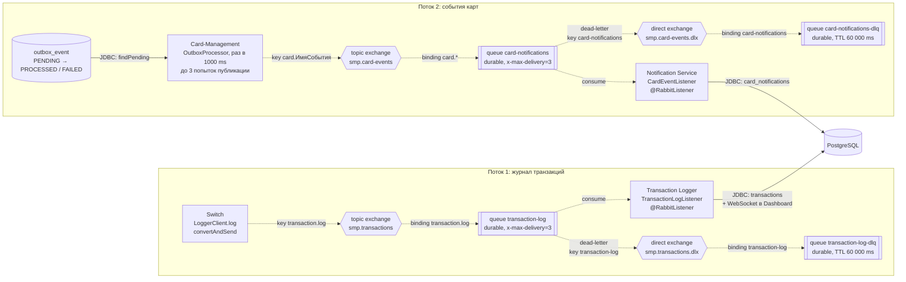

# А5. RabbitMQ-топология

## Чего не хватало и что сделано

- В `docs/architecture.md` топология описана таблицей и текстом, диаграммы нет.
- Сделано: схема двух асинхронных потоков по классам `RabbitMQConfig` трёх сервисов: producer → exchange → queue → consumer, плюс DLX и DLQ. Отдельно сверено, какие параметры надёжности реально есть в коде.
- Все стрелки на схеме - async (AMQP), кроме записи в PostgreSQL.

## Диаграмма

## Подтверждение кодом

| Элемент | Где объявлен |
|---|---|
| `smp.transactions`, `transaction-log`, `smp.transactions.dlx`, `transaction-log-dlq` | [`switch/.../RabbitMQConfig.java`](../../../services/switch/src/main/java/com/processing/config/RabbitMQConfig.java) - полная топология с DLX и DLQ |
| то же, сторона потребителя | [`transaction-logger/.../RabbitMQConfig.java`](../../../services/transaction-logger/src/main/java/com/processing/transactionlogger/config/RabbitMQConfig.java) - только exchange, очередь и binding, **без DLX и DLQ** |
| `smp.card-events`, `card-notifications`, DLX, DLQ | [`card-management/.../RabbitMQConfig.java`](../../../services/card-management/src/main/java/com/processing/cardmanagement/config/RabbitMQConfig.java) и [`notification-service/.../RabbitMQConfig.java`](../../../services/notification-service/src/main/java/com/processing/notification/config/RabbitMQConfig.java) |
| Публикация транзакции | [`LoggerClient.java`](../../../services/switch/src/main/java/com/processing/service/LoggerClient.java) |
| Публикация событий карт | [`OutboxProcessor.java`](../../../services/card-management/src/main/java/com/processing/cardmanagement/services/OutboxProcessor.java), [`OutboxEventProcessorImpl.java`](../../../services/card-management/src/main/java/com/processing/cardmanagement/services/OutboxEventProcessorImpl.java) |
| Какие события идут в outbox | [`CardOutboxEvent.java`](../../../services/card-management/src/main/java/com/processing/cardmanagement/events/CardOutboxEvent.java) - создание, изменение, удаление, резерв, откат, массовое обновление, генерация |
| Потребители | [`TransactionLogListener.java`](../../../services/transaction-logger/src/main/java/com/processing/transactionlogger/listener/TransactionLogListener.java), [`CardEventListener.java`](../../../services/notification-service/src/main/java/com/processing/notification/listener/CardEventListener.java) |
| Идемпотентность потребителя журнала | [`TransactionService.store`](../../../services/transaction-logger/src/main/java/com/processing/transactionlogger/service/TransactionService.java) - повтор с тем же `id` не создаёт дубль |

## Механика надёжности: документация и код

| Механизм | В документации | В коде |
|---|---|---|
| Publisher confirms | Switch ждёт подтверждения 2 с, иначе откат | `publisher-confirm-type: correlated` включён в конфигурации Switch и Card-Management, но ожидания подтверждения в коде нет. Откат в Switch запускается только при `AmqpException` |
| Retry публикации, 3 попытки | exponential backoff | Только у outbox: `app.outbox.max-retry-count=3`, повтор на следующем запуске через 1 с, без нарастающей задержки; после 3 неудач статус `FAILED` |
| Retry потребителя, 3 попытки | после 3 неудач сообщение уходит в DLQ | У очередей задан аргумент `x-max-delivery=3`. В конфигурации Logger и Notification настроек `listener.retry` нет. Переход в DLQ после 3 попыток нужно подтвердить интеграционным тестом (TC-P3-09) |
| TTL 60 с | - | Это время жизни сообщения **в DLQ** (`ttl(60_000)`), а не пауза между повторами |
| Durable | - | Все exchange и очереди объявлены durable |

## Что увидел в коде и чего нет в документации

- DLX и DLQ для потока транзакций объявляет только Switch. Если первым стартует Logger, он создаст очередь `transaction-log` с теми же аргументами, но сами `smp.transactions.dlx` и `transaction-log-dlq` появятся только после старта Switch.
- Routing key события карты - `card.` плюс имя Java-класса события, например `card.CardServiceReserveEvent`. Notification Service берёт тип события из этого ключа.
- Потребитель Notification при любой ошибке бросает `RuntimeException`, то есть сообщение не подтверждается.

## Для чего пригодится

Схема показывает точки для интеграционных тестов с RabbitMQ:
- сообщение дошло до потребителя и запись появилась в БД;
- повторная доставка не создаёт дубль;
- сообщение, которое потребитель не может обработать, попадает в DLQ;
- событие в outbox при недоступном брокере остаётся `PENDING` и уходит после восстановления.
