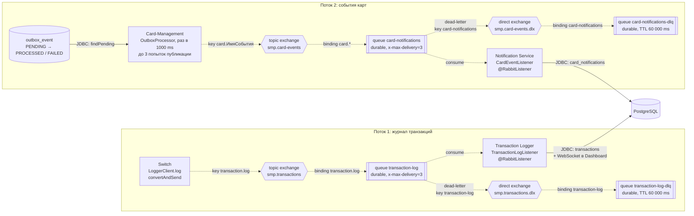

# А5. RabbitMQ-топология

## Чего не хватало и что сделано

- В `docs/architecture.md` топология описана таблицей и текстом, диаграммы нет.
- Сделано: схема двух асинхронных потоков по классам `RabbitMQConfig` трёх сервисов: producer → exchange → queue → consumer, плюс DLX и DLQ. Отдельно сверено, какие параметры надёжности реально есть в коде.
- Все стрелки на схеме - async (AMQP), кроме записи в PostgreSQL.

## Диаграмма

## Подтверждение кодом

### Поток 1: журнал транзакций

| Стрелка или блок диаграммы | Файл и строка кода |
|---|---|
| Switch ⇢ `smp.transactions`, ключ `transaction.log` | [`LoggerClient.java`](../../../services/switch/src/main/java/com/processing/service/LoggerClient.java) - `rabbitTemplate.convertAndSend(RabbitMQConfig.EXCHANGE, RabbitMQConfig.ROUTING_KEY, transaction)`; [`switch/.../RabbitMQConfig.java`](../../../services/switch/src/main/java/com/processing/config/RabbitMQConfig.java) - `EXCHANGE = "smp.transactions"`, `ROUTING_KEY = "transaction.log"`, `new TopicExchange(EXCHANGE, true, false)` |
| `smp.transactions` ⇢ `transaction-log`, binding | [`switch/.../RabbitMQConfig.java`](../../../services/switch/src/main/java/com/processing/config/RabbitMQConfig.java) - `QUEUE = "transaction-log"`, `BindingBuilder.bind(transactionLogQueue).to(smpTransactionsExchange).with(ROUTING_KEY)` |
| Очередь `transaction-log`: durable, `x-max-delivery=3`, dead-letter в DLX | [`switch/.../RabbitMQConfig.java`](../../../services/switch/src/main/java/com/processing/config/RabbitMQConfig.java) - `QueueBuilder.durable(QUEUE).withArgument("x-dead-letter-exchange", DLX_EXCHANGE).withArgument("x-dead-letter-routing-key", DLQ_ROUTING_KEY).withArgument("x-max-delivery", 3)` |
| `smp.transactions.dlx` ⇢ `transaction-log-dlq`, TTL 60 000 ms | [`switch/.../RabbitMQConfig.java`](../../../services/switch/src/main/java/com/processing/config/RabbitMQConfig.java) - `DLX_EXCHANGE = "smp.transactions.dlx"`, `new DirectExchange(DLX_EXCHANGE, true, false)`; `DLQ_QUEUE = "transaction-log-dlq"`, `QueueBuilder.durable(DLQ_QUEUE).ttl(60_000)`; binding `.with(DLQ_ROUTING_KEY)`, где `DLQ_ROUTING_KEY = "transaction-log"` |
| `transaction-log` ⇢ Transaction Logger | [`TransactionLogListener.java`](../../../services/transaction-logger/src/main/java/com/processing/transactionlogger/listener/TransactionLogListener.java) - `@RabbitListener(queues = RabbitMQConfig.QUEUE)`; [`transaction-logger/.../RabbitMQConfig.java`](../../../services/transaction-logger/src/main/java/com/processing/transactionlogger/config/RabbitMQConfig.java) объявляет тот же exchange, очередь и binding, но **без DLX и DLQ** |
| Transaction Logger → PostgreSQL и WebSocket | [`TransactionService.java`](../../../services/transaction-logger/src/main/java/com/processing/transactionlogger/service/TransactionService.java) - `store`: `transactionRepository.saveAndFlush`, `webSocketManager.broadcast`; перед записью `transactionRepository.findById(request.id())` - повтор с тем же `id` не создаёт дубль |

### Поток 2: события карт

| Стрелка или блок диаграммы | Файл и строка кода |
|---|---|
| Запись события в `outbox_event` | [`CardEventNotifierImpl.java`](../../../services/card-management/src/main/java/com/processing/cardmanagement/events/CardEventNotifierImpl.java) - `outboxEventProcessor.save(new CardOutboxEventData(outboxEvent))`; [`CardOutboxEvent.java`](../../../services/card-management/src/main/java/com/processing/cardmanagement/events/CardOutboxEvent.java) - в outbox идут события создания, изменения, удаления, резерва, отката, массового обновления и генерации |
| `outbox_event` → `OutboxProcessor`: раз в 1000 ms, до 3 попыток | [`OutboxProcessor.java`](../../../services/card-management/src/main/java/com/processing/cardmanagement/services/OutboxProcessor.java) - `@Scheduled(fixedDelayString = "${app.outbox.interval-ms}")`, `outboxRepository.findPending(outboxOptions.maxRetryCount())`; [`application.properties`](../../../services/card-management/src/main/resources/application.properties) - `app.outbox.interval-ms=${OUTBOX_INTERVAL_MS:1000}`, `app.outbox.max-retry-count=${OUTBOX_MAX_RETRY_COUNT:3}` |
| Статусы `PENDING` → `PROCESSED` / `FAILED` | [`OutboxEventProcessorImpl.java`](../../../services/card-management/src/main/java/com/processing/cardmanagement/services/OutboxEventProcessorImpl.java) - после публикации `outboxEventData.processed()`; в `handleFail`: `withRetry`, а при `retryCount() >= maxRetryCount()` - `failed()` |
| Card-Management ⇢ `smp.card-events`, ключ `card.ИмяСобытия` | [`OutboxEventProcessorImpl.java`](../../../services/card-management/src/main/java/com/processing/cardmanagement/services/OutboxEventProcessorImpl.java) - `rabbitTemplate.convertAndSend(RabbitMQConfig.CARD_EVENTS_EXCHANGE, RabbitMQConfig.ROUTING_KEY_PREFIX + event.getClass().getSimpleName(), event)`; [`card-management/.../RabbitMQConfig.java`](../../../services/card-management/src/main/java/com/processing/cardmanagement/config/RabbitMQConfig.java) - `CARD_EVENTS_EXCHANGE = "smp.card-events"`, `ROUTING_KEY_PREFIX = "card."`, `new TopicExchange(...)` |
| `smp.card-events` ⇢ `card-notifications`, binding `card.*` | [`card-management/.../RabbitMQConfig.java`](../../../services/card-management/src/main/java/com/processing/cardmanagement/config/RabbitMQConfig.java) - `QUEUE = "card-notifications"`, `BindingBuilder.bind(cardNotificationsQueue).to(cardEventsExchange).with(ROUTING_KEY_PREFIX + "*")` |
| Очередь `card-notifications`, её DLX и DLQ | [`card-management/.../RabbitMQConfig.java`](../../../services/card-management/src/main/java/com/processing/cardmanagement/config/RabbitMQConfig.java) и [`notification-service/.../RabbitMQConfig.java`](../../../services/notification-service/src/main/java/com/processing/notification/config/RabbitMQConfig.java) - одинаково в обоих сервисах: `withArgument("x-dead-letter-exchange", DLX_EXCHANGE)`, `withArgument("x-max-delivery", 3)`; `DLX_EXCHANGE = "smp.card-events.dlx"`, `DLQ_QUEUE = "card-notifications-dlq"`, `DLQ_TTL_MS = 60_000` |
| `card-notifications` ⇢ Notification Service → PostgreSQL | [`CardEventListener.java`](../../../services/notification-service/src/main/java/com/processing/notification/listener/CardEventListener.java) - `@RabbitListener(queues = RabbitMQConfig.QUEUE)`, `extractEventType(routingKey)`, `repository.save(notification)` |

## Механика надёжности: документация и код

| Механизм | В документации | В коде |
|---|---|---|
| Publisher confirms | Switch ждёт подтверждения 2 с, иначе откат | `publisher-confirm-type: correlated` включён в конфигурации Switch и Card-Management, но ожидания подтверждения в коде нет. Откат в Switch запускается только при `AmqpException` |
| Retry публикации, 3 попытки | exponential backoff | Только у outbox: `app.outbox.max-retry-count=3`, повтор на следующем запуске через 1 с, без нарастающей задержки; после 3 неудач статус `FAILED` |
| Retry потребителя, 3 попытки | после 3 неудач сообщение уходит в DLQ | У очередей задан аргумент `x-max-delivery=3`. В конфигурации Logger и Notification настроек `listener.retry` нет. Переход в DLQ после 3 попыток нужно подтвердить интеграционным тестом (TC-P3-09) |
| TTL 60 с | DLQ с TTL 60 с (`docs/architecture.md`) | Совпадает: у обеих DLQ задано `ttl(60_000)`. Это время жизни сообщения в DLQ, а не пауза между повторами |
| Durable | не упоминается | Взято из кода: все exchange и очереди объявлены durable - `QueueBuilder.durable(...)`, `new TopicExchange(EXCHANGE, true, false)` |

## Что увидел в коде и чего нет в документации

- DLX и DLQ для потока транзакций объявляет только Switch. Если первым стартует Logger, он создаст очередь `transaction-log` с теми же аргументами, но сами `smp.transactions.dlx` и `transaction-log-dlq` появятся только после старта Switch.
- Routing key события карты - `card.` плюс имя Java-класса события, например `card.CardServiceReserveEvent`. Notification Service берёт тип события из этого ключа.
- Потребитель Notification при любой ошибке бросает `RuntimeException`, то есть сообщение не подтверждается.

## Для чего пригодится

Схема показывает точки для интеграционных тестов с RabbitMQ:
- сообщение дошло до потребителя и запись появилась в БД;
- повторная доставка не создаёт дубль;
- сообщение, которое потребитель не может обработать, попадает в DLQ;
- событие в outbox при недоступном брокере остаётся `PENDING` и уходит после восстановления.
