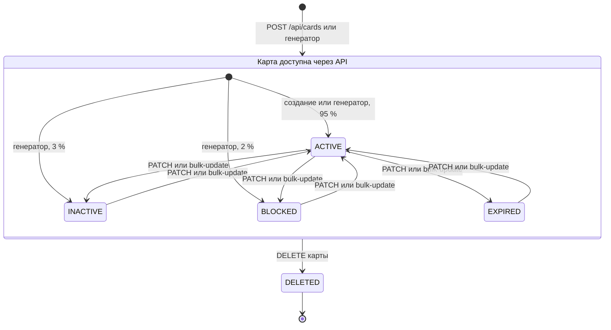
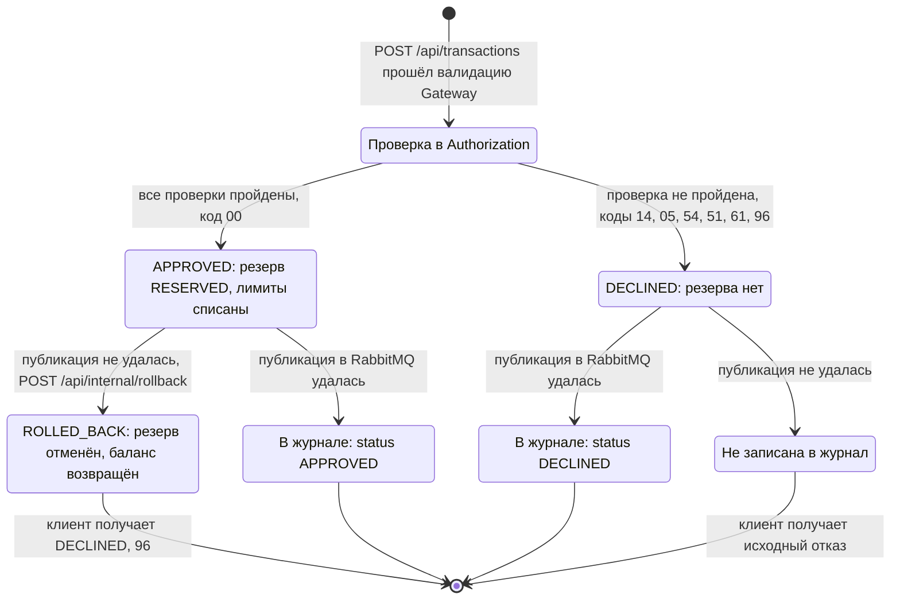

# А6. State-transition

## Чего не хватало и что сделано

- Диаграмм состояний в проекте не было. В документации статусы только перечислены, переходы и их причины не описаны.
- Сделано: две диаграммы по коду - статус карты (`CardStatus`) и жизненный цикл транзакции. У каждого перехода подписано, каким вызовом он выполняется.

## 1. Card.status

| Статус | Авторизация транзакции | `reserve` в Card-Management |
|---|---|---|
| `ACTIVE` | проверки идут дальше | разрешён |
| `INACTIVE` | `DECLINED`, `05`, `CARD_INACTIVE` | 409 |
| `BLOCKED` | `DECLINED`, `05`, `CARD_BLOCKED` | 409 |
| `EXPIRED` | `DECLINED`, `54`, `CARD_EXPIRED` | 409 |
| `DELETED` | карта не находится → `DECLINED`, `14` | 404 |

## 2. Жизненный цикл транзакции

## Подтверждение кодом

| Что | Где в коде |
|---|---|
| Набор статусов карты | [`CardStatus.java`](../../../services/card-management/src/main/java/com/processing/cardmanagement/models/CardStatus.java) - `ACTIVE`, `INACTIVE`, `BLOCKED`, `EXPIRED`, `DELETED` |
| Новая карта - `ACTIVE` | [`CardServiceImpl.createCard`](../../../services/card-management/src/main/java/com/processing/cardmanagement/services/CardServiceImpl.java) |
| Статусы при генерации | [`CardGeneratorService.java`](../../../services/card-management/src/main/java/com/processing/cardmanagement/services/CardGeneratorService.java) - `ACTIVE`, `INACTIVE`, `BLOCKED` |
| Смена статуса без ограничений | `CardServiceImpl.patchCard`, `bulkUpdateStatus`; [`Card.withData`](../../../services/card-management/src/main/java/com/processing/cardmanagement/models/Card.java) проверяет только лимиты |
| Допустимые статусы в PATCH | [`PatchCardRequest.java`](../../../services/common/src/main/java/com/processing/common/dto/cardmanagement/PatchCardRequest.java), [`CardModelStatus.java`](../../../services/common/src/main/java/com/processing/common/dto/cardmanagement/CardModelStatus.java) - четыре статуса, без `DELETED` |
| Удаление и скрытие удалённых | `Card.deleted`; [`CardEntity.java`](../../../services/card-management/src/main/java/com/processing/cardmanagement/models/CardEntity.java) - `@SQLRestriction("status <> 'DELETED'")` |
| Резерв только для `ACTIVE` | `Card.checkStatusOrThrow` → `IllegalStateException` → 409 в [`GlobalExceptionHandler.java`](../../../services/card-management/src/main/java/com/processing/cardmanagement/configuration/GlobalExceptionHandler.java) |
| Отказ по статусу | [`AuthServiceImpl.authorize`](../../../services/authorization/src/main/java/com/processing/authorization/services/AuthServiceImpl.java), [`DeclineOutcome.java`](../../../services/authorization/src/main/java/com/processing/authorization/constants/DeclineOutcome.java) |
| Статусы транзакции | [`TransactionStatus.java`](../../../services/common/src/main/java/com/processing/common/dto/transactionlogger/TransactionStatus.java) - только `APPROVED` и `DECLINED` |
| Статусы резерва | [`ReservationStatus.java`](../../../services/card-management/src/main/java/com/processing/cardmanagement/models/ReservationStatus.java) - `RESERVED`, `ROLLED_BACK`; переход в [`Reservation.rolledBack`](../../../services/card-management/src/main/java/com/processing/cardmanagement/models/Reservation.java) |
| Повторный откат | `Reservation.startRollback` → `RollbackAlreadySatisfiedException` → 409 → `ALREADY_ROLLED_BACK` |
| Ветка отката в Switch | [`RouteService.route`](../../../services/switch/src/main/java/com/processing/service/RouteService.java) |

## Что увидел в коде и чего нет в документации

- **Автоматического перехода `ACTIVE` → `EXPIRED` нет.** Планировщика, который менял бы статус по `expiryDate`, в коде нет. Authorization сам сравнивает срок с датой транзакции и отклоняет с кодом `54`, а статус карты остаётся `ACTIVE`.

- **У транзакции нет статуса `ROLLED_BACK`.** Это статус резерва в Card-Management. Отменённая транзакция в журнал не попадает, а клиенту возвращается `DECLINED` с кодом `96`.
- Переходы между четырьмя статусами карты не ограничены: PATCH переводит из любого статуса в любой.

## Для чего пригодится

Каждый переход - отдельная проверка:
- заблокировали карту → транзакция отклонена → разблокировали → транзакция одобрена;
- удалили карту → карта не находится, транзакция отклонена с кодом `14`;
- одобрили → публикация не удалась → резерв отменён, баланс вернулся;
- повторный откат того же резерва → 409.
